# 🎨 Advanced Bob Ross: Joy of Painting API  
## *“We don’t make mistakes — just happy little accidents.”*

[](https://www.python.org/)  
[](https://www.postgresql.org/)  
[](https://flask.palletsprojects.com/)  
[](https://en.wikipedia.org/wiki/Extract,_transform,_load)  
[](https://www.twoinchbrush.com/)  
[](https://github.com/HBTN)  
[](LICENSE)

> A full-stack REST API that powers interactive exploration of *The Joy of Painting* — now enhanced with **Tools**, **Techniques**, **Authentication**, **Pagination**, and a **Beautiful Frontend**.

---

## 📌 Project Context (HBTN Task)

| Requirement | Status |
|-------------|--------|
| ✅ Team of 1 | Yes — modular, collaborative design |
| ✅ Design docs | `Design Documents/` included |
| ✅ MVP scope | 5 datasets, 7 DB tables, secure API, UI |
| ✅ Manual QA ready | Full local setup guide included |
| ✅ Hostable (optional) | Docker/Render-ready (stretch) |

🎯 **Goal**: Build a *custom, from-scratch API* that lets users explore 403 episodes by **Month**, **Color**, **Subject**, **Tool**, and **Technique** — with modern dev practices.

---

## 🧠 Vision & MVP Scope

| Feature | Priority | Status | ETA |
|--------|----------|--------|-----|
| ✅ Core ETL (3 datasets) | MVP | 🟢 Done | Day 1 |
| ✅ Advanced ETL (2 new datasets) | MVP | 🟢 Done | Day 2 |
| ✅ Auth + Pagination | MVP | 🟢 Done | Day 2 |
| ✅ REST API (GET/POST) | MVP | 🟢 Done | Day 3 |
| ✅ Responsive Frontend | MVP | 🟢 Done | Day 3 |
| 📊 Analytics Dashboard | Stretch | ⏳ Planned | Day 4+ |
| 📱 Mobile PWA | Stretch | ⏳ Planned | Day 5+ |
| ☁️ Deploy to Render | Stretch | ⏳ Planned | Day 5 |

⏱️ **Timeline:**  
- **Day 1**: Design + DB Schema  
- **Day 2**: ETL (core + advanced)  
- **Day 3**: API + Frontend  
- **Day 4**: Testing + Docs  
- **Day 5**: Demo + QA

---

## 🛠️ Tech Stack

| Layer | Tools |
|-------|-------|
| **Database** | PostgreSQL 14 |
| **Backend** | Python 3.10, Flask, SQLAlchemy, Flask-CORS, PyJWT |
| **ETL** | Pandas, `csv`, regex parsing, error-tolerant loading |
| **Frontend** | Vanilla HTML/CSS/JS (no framework bloat!) |
| **DevOps** | Docker (optional), GitHub Actions (CI), Render (deployment) |
| **Testing** | `unittest`, `pytest`, manual QA checklist |

---

## 🗃️ Database Schema (ERD)

```mermaid
erDiagram
    Episode ||--o{ EpisodeColor : contains
    Episode ||--o{ EpisodeSubject : features
    Episode ||--o{ EpisodeTool : uses
    Episode ||--o{ EpisodeTechnique : applies
    Color ||--o{ EpisodeColor : used_in
    SubjectMatter ||--o{ EpisodeSubject : appears_in
    Tool ||--o{ EpisodeTool : used_in
    Technique ||--o{ EpisodeTechnique : applied_in
    Tool }|--|| Technique : enables

    Episode {
        INT id PK "S1E1 → id=1"
        VARCHAR title
        INT season_number
        INT episode_number
        DATE air_date
        TEXT youtube_url
        TEXT image_url
    }
    
    Color {
        INT id PK
        VARCHAR name "e.g., Alizarin Crimson"
        CHAR hex_code "#RRGGBB"
    }
    
    SubjectMatter {
        INT id PK
        VARCHAR name "e.g., Mountain, Cabin"
    }
    
    Tool {
        VARCHAR(10) id PK "e.g., TL001"
        VARCHAR name "e.g., 2-Inch Brush"
        VARCHAR category "Brush / Knife / Medium"
        TEXT primary_uses
        TEXT compatible_colors
    }
    
    Technique {
        VARCHAR(10) id PK "e.g., T004"
        VARCHAR name "e.g., Wet-on-Wet"
        TEXT description
        VARCHAR difficulty_level "Beginner / Intermediate / Advanced"
    }
```



**Key Relationships:**  
- 5-way filtering: Month, Color, Subject, Tool, Technique  
- AND/OR logic supported  
- Preserved IDs for authenticity  
- Fully normalized (0% duplicate data)  

**Data Stats:**

| Table | Rows | Purpose |
|-------|------|---------|
| Episode | 403 | Metadata for each painting episode |
| Color | 18 | All paint colors used in the series |
| SubjectMatter | 70+ | Subject tags (e.g., Tree, Ocean) |
| Tool | 12 | Brushes, knives, mediums |
| Technique | 10 | Painting methods |
| EpisodeColor | ~3,500 | Links episodes to their colors |
| EpisodeSubject | ~9,000 | Links episodes to their subjects |
| EpisodeTool | ~500 | Links episodes to tools used |
| EpisodeTechnique | ~500 | Links episodes to techniques applied |
| ToolTechnique | ~20 | Maps tools to compatible techniques |

---

## 📁 Project Structure

```
Advanced_Bob_Ross_Joy_Of_Painting/
├── database/schema.sql
├── etl/seed_database.py
├── api/
│   ├── app.py
│   ├── config.py
│   ├── auth.py
│   └── pagination.py
├── frontend/
│   ├── index.html
│   ├── style.css
│   └── script.js
├── data/
│   ├── episode_dates.csv
│   ├── colors_used.csv
│   ├── subject_matter.csv
│   ├── bob_ross_tools.csv.txt
│   └── bob_ross_techniques.csv.txt
├── Design Documents/
│   ├── 01_Project_Proposal.md
|
├── tests/test_pagination.py
├── requirements.txt
├── .env.example
├── .env
├── LICENSE
└── README.md
```

---

## 🚀 Quick Start Guide

**Prerequisites:** Linux/macOS (or WSL on Windows), Python 3.8+, PostgreSQL 12+, git

**Step 1: Install PostgreSQL**

```bash
# Ubuntu/Debian
sudo apt update && sudo apt install -y postgresql postgresql-contrib

# Amazon Linux 2
sudo amazon-linux-extras enable postgresql14
sudo yum install -y postgresql-server
sudo postgresql-setup --initdb

sudo systemctl start postgresql
sudo systemctl enable postgresql
sudo nano /var/lib/pgsql/data/pg_hba.conf
# Change "peer"/"ident" to "trust" for local dev
sudo systemctl restart postgresql
```

**Step 2: Clone & Setup**

```bash
git clone https://github.com/your-team/Advanced_Bob_Ross_Joy_Of_Painting.git
cd Advanced_Bob_Ross_Joy_Of_Painting
python3 -m venv venv && source venv/bin/activate
pip install -r requirements.txt
```

**Step 3: Create Database**

```bash
psql -U postgres -c "CREATE DATABASE advanced_bob_ross_joy_of_painting;"
psql -U postgres -d advanced_bob_ross_joy_of_painting -f database/schema.sql
```

**Step 4: Run ETL**

```bash
cd etl
python seed_database.py
# 🎉 Database seeding completed successfully!
```

**Step 5: Start API**

```bash
cd api
python app.py
# Running on http://localhost:5000
```

**Step 6: Launch Frontend**

```bash
cd frontend
python3 -m http.server 8080
# Open http://localhost:8080
```

✅ You’re done! Generate token, select filters, and enjoy the episodes.

---

## 🌐 API Documentation

**Authentication:** All `/api/episodes` endpoints require a JWT token.

```python
from api.auth import generate_token
print(generate_token("admin"))
# Use in header: Authorization: Bearer <token>
```

**Endpoints:**

| Method | Endpoint | Description |
|--------|---------|------------|
| GET    | /api/health | Ping |
| GET    | /api/colors | All colors |
| GET    | /api/subjects | All subjects |
| GET    | /api/tools | All tools |
| GET    | /api/techniques | All techniques |
| GET    | /api/episodes | Filtered episodes (auth) |
| POST   | /api/episodes | Complex filters (auth) |
| GET    | /api/episodes/<s>/<e> | Full episode detail (auth) |

**Filters:**

| Param | Type | Example | Description |
|-------|------|---------|-------------|
| month | int | 12 | December |
| color | string | Alizarin Crimson | Partial match OK |
| subject | string | Mountain | |
| tool | string | Fan Brush | |
| technique | string | Wet-on-Wet | |
| filter_type | string | AND/OR | Combine logic |
| page | int | 1 | Default |
| per_page | int | 10 | Max 100 |

**Sample Paginated Response:**

```json
{
  "episodes": [
    {
      "id": 399,
      "title": "Reflections of Calm",
      "season": 31,
      "episode": 1,
      "air_date": "1994-02-22",
      "youtube_url": "https://youtube.com/...",
      "image_url": "https://twoinchbrush.com/...png",
      "colors": ["Alizarin Crimson", "Prussian Blue"],
      "subjects": ["Mountains", "Trees", "Water"],
      "tools": ["2-Inch Brush", "Fan Brush", "Palette Knife"],
      "techniques": ["Wet-on-Wet", "Happy Little Trees"]
    }
  ],
  "pagination": {"page":1,"per_page":20,"total":403,"pages":21},
  "filters_applied": {"months":["12"],"tools":["Fan Brush"],"logic":"AND"}
}
```

---

## 🖥️ Frontend Preview & Features

✅ Multi-select filters, AND/OR toggle, one-click token, episode cards, fully responsive.

**Episode Card Example:**

```
┌───────────────────────────────┐
│ 🎨 Reflections of Calm (S31E1) │
│ 📅 February 22, 1994          │
│ 🌲 Subjects: Mountains, Trees │
│ 🖌️ Tools: 2-Inch Brush, Fan Brush │
│ 🎯 Techniques: Wet-on-Wet      │
│ 🎥 [▶ Watch on YouTube]       │
└───────────────────────────────┘
```

---

## 📝 Design Documents

- 01_Project_Proposal.md
- 02_API_Documentation.md
- 03_Database_Documentation.md
- 04_Wireframes_UI.md

## 🧪 Testing & QA Checklist

- Unit tests: `tests/test_pagination.py`
- Manual QA: filters, pagination, token auth
- ETL: verify all 5 datasets imported correctly

## 📜 License


